class: center, inverse
background-image: url("images/cool.png")

```{r, include = FALSE}
# run code but not shown in the presentation
library(xaringan)
library(tidygraph)
library(tidyverse)
library(ggraph) 
library(ggplot2)
library(readr)

url <- "https://raw.githubusercontent.com/rfordatascience/tidytuesday/master/data/2019/2019-02-26/small_trains.csv"
small_trains <- read_csv(url)
head(small_trains)

routes <- small_trains %>%
group_by(departure_station, arrival_station) %>%
summarise(journey_time = mean(journey_time_avg)) %>%
ungroup() %>%
mutate(from = departure_station, 
         to = arrival_station) %>%
select(from, to, journey_time)
```


# Network Graphs with `ggraph` and `tidygraph`

a presentation by Ania and Johanna


.footnote[[gif source](https://media.giphy.com/media/7VzgMsB6FLCilwS30v/giphy-downsized-large.gif)]

???
Hi and welcome to our workshop on networks with ggraph and tidygraph. My name is Johanna and together with Ania, I will guide you through the basic concepts and a few examples of networks.
---
class: inverse
# Content

.left-column[ <br /> Kevin Bacon [source](http://mediad.publicbroadcasting.net/p/wnpr/files/styles/x_large/public/201511/Kevin_Bacon_2_SDCC_2014.jpg)]

.right-column[### 1. Introduction (Bacon, Erdös, what & why)

### 2. Basic concepts of networks (nodes, edges & more)]
<br />
.pull-left[### 3. & 4. Networks with `tidygraph` and `ggraph`]

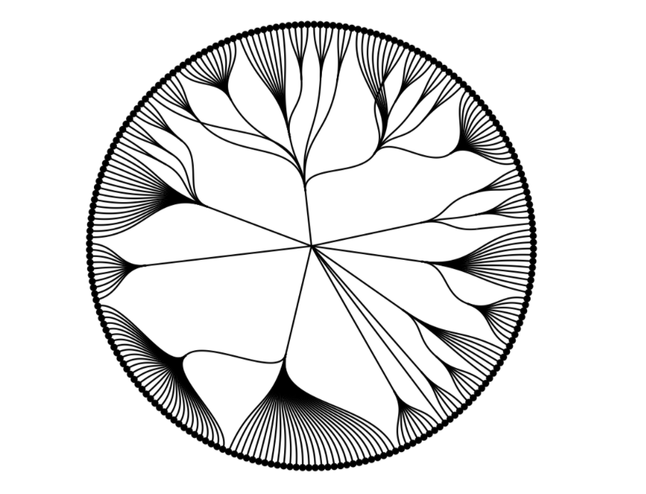
.pull-right[[source](https://ggraph.data-imaginist.com/articles/Layouts.html)]

???
We will start with a short introduction what networks are good for and then explore some basic terms. After that, Ania will introduce a selection of important functions of both packages and show you some applications.
---
class: inverse

## Intro - The Oracle of Bacon
### 1.1 What is a network?

.center[<iframe width="900" height="450" src="https://www.youtube.com/embed/Fj7HxmsN-iQ" title="YouTube video player" frameborder="0" allow="accelerometer; autoplay; clipboard-write; encrypted-media; gyroscope; picture-in-picture" allowfullscreen></iframe>]

.footnote[Source...]

???
So - what is a network?
As a simple example, I will show you the so-called “Kevin Bacon game”, that assumes that Kevin is basically the center of the movie universe.

We can pick any random actor and find out how he is connected with Kevin Bacon. Here I tried Angelina Jolie and found out that she was casted for the movie "Shark Tale" where she was in with Renée Zellweger who was in the movie "My One and Only" with Kevin Bacon.
Since she is not directly linked to Bacon, but is “two movies away from him” so to speak, her Bacon number is 2. We can also see other links, also called “paths” how she is connected to Kevin Bacon – for example through a movie she was in with Robert De Niro.

-> The underlying network is based on the idea of the “Erdös number”, which measures how interconnected mathematicians are in terms of research, stated by the “distance” of number of publications they are away from the famous mathematician Erdös who published over 500 papers.

But why do we need network analysis?

---
##1.2 Why network analysis?

### ...an approach to map complexity 

- "connectedness" of modern society
- rapid growth of the Internet and the Web
- news, financial crisises (and epidemics...) spread around the world with high speed and intensity

???
In recent years there has been a growing public fascination with the complex "connectedness" of modern society. It is found within many developments: in the rapid growth of the Internet and the Web, in the ease with which global communication now takes place, and in the ability of news and information as well as epidemics and financial crises to spread around the world.

--

### ...in an interdisciplinary fashion

- perspectives including networks, crowds and markets
- at the interface of economics, sociology, computing and information science & applied mathematics
- empirical & data driven

.footnote[Source: https://www.cs.cornell.edu/home/kleinber/networks-book/]

???
Networks, Crowds, and Markets combine different scientific perspectives in their approach to understanding networks and behavior. Network analysis is an empirical and data driven approach.
Drawing on ideas from economics, sociology, computer science, and applied mathematics, it addresses fundamental questions about how our social, economic, and technological worlds are connected.
---
##1.3 ABC of (societal) applications 

- "c" like [cascades and clusters](https://www.cs.cornell.edu/home/kleinber/networks-book/networks-book-ch19.pdf)
- "e" like epidemics
- "f" like friend and follower suggestions in social networks
- "i" like investigative journalism, e.g. on [political parties' microtargeting strategies](https://targetleaks.de/netzwerkdiagramme)
- "m" like management or [metabolic engineering](https://en.wikipedia.org/wiki/Metabolic_engineering) 
- "p" like property rights, determining [socially optimal allocations](https://www.cs.cornell.edu/home/kleinber/networks-book/networks-book-ch24.pdf)
- "s" like [small world phenomena](https://www.cs.cornell.edu/home/kleinber/networks-book/networks-book-ch20.pdf) and the [structure of the web](https://www.cs.cornell.edu/home/kleinber/networks-book/networks-book-ch13.pdf)
- "w" like web ranking
- "v" like voting behaviour

.center[
.pull-left[[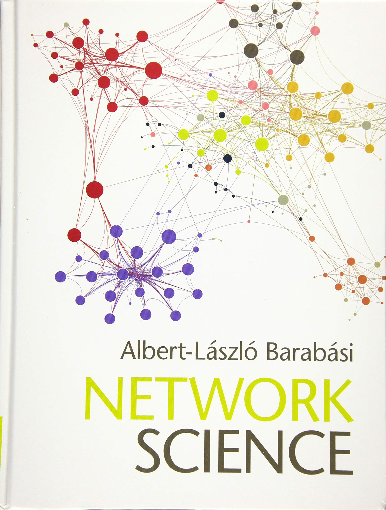](http://networksciencebook.com/)]
.pull-right[[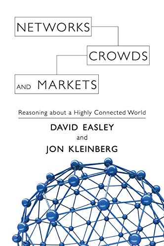](https://www.cs.cornell.edu/home/kleinber/networks-book/)]
]

???
I found it little difficult to give you a full impression on how big this topic is. That is why I created a little ABC from "c" like cascades and clusters to "v" like voting behavior, linked to some fascinating books, where you can explore the variety of fields and phenomenas that can be approached with network analysis.

---
class: inverse

# Basics concepts of networks

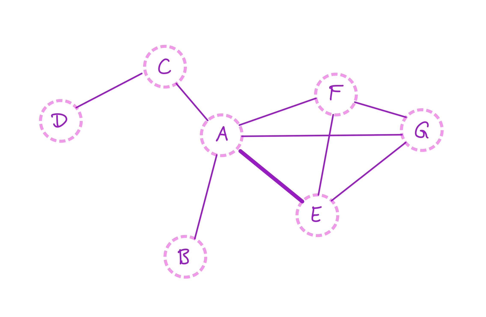

???
No matter which aplication you look at, all are based on the same ideas: the basic concepts of networks. Our time today is short, but I will at least introduce you to some important network terms that hopefully help you to understand the later examples.

---
# 2.1 Nodes and Edges

### nodes, represented by circles:
.center[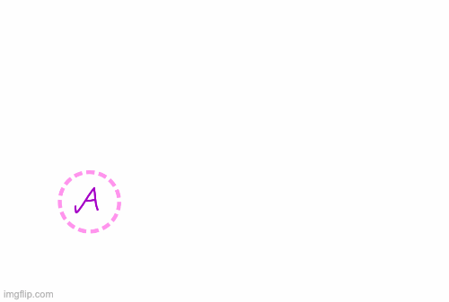]

???
Here we have a person A, B and C, all represented by a circle. In network theory, these are "nodes", sometimes also called "vertices".
---
# 2.1 Nodes and Edges

### ...and edges, connecting the nodes:  

.center[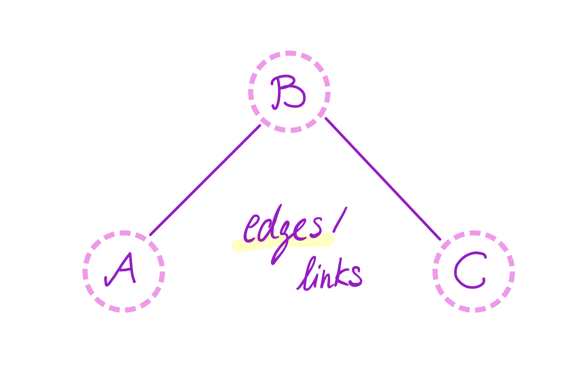]

???
We can have connections between those people – they are called "edges" or "links". Edges represent a relationship between nodes – in social networks, these are mostly friendships.

---
# 2.2 graph or network

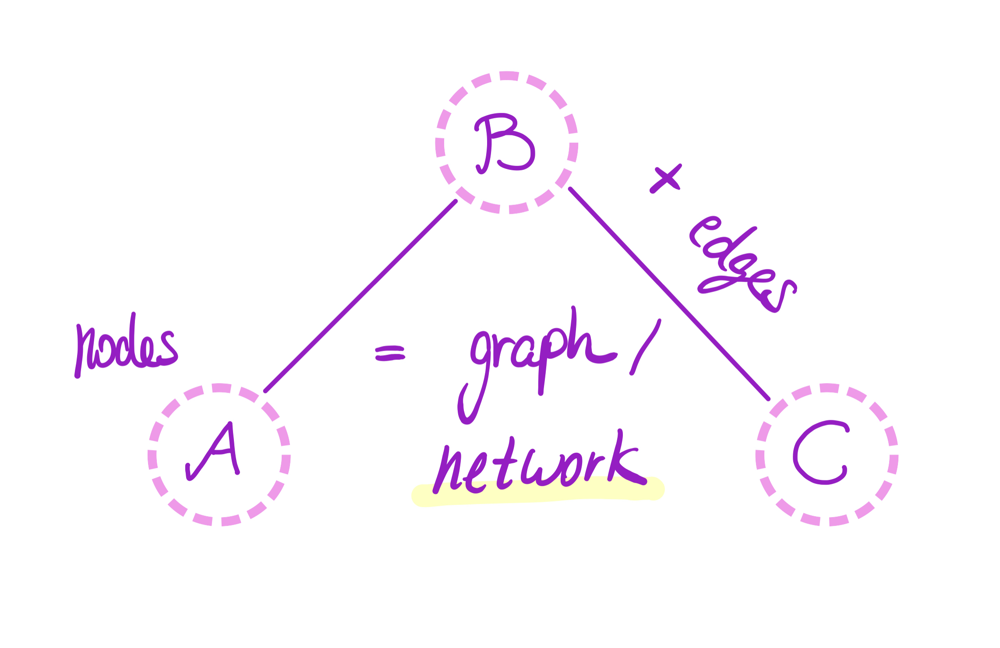

???
At the end, a "network", also called "graph", is just a collection of nodes and edges. 

---
# 2.3 directed and undirected networks

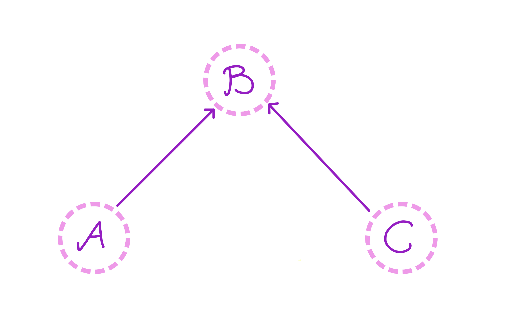 
.pull-right[B could be a celebrity, known by A and C]

???
If the edges have arrow heads, we call it a "directed network".
A and C know B, but B doesn’t know them. Possible explanation: B could be a celebrity, A and C her or his fans.
--
.right-column[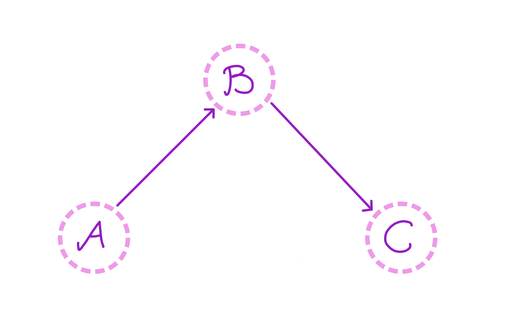] 
<br / >
<br / >
.left-column[B could be a football player, C could be the queen]

???
In the second graph, B could maybe be a football player known by A, but C could be the queen, not knowing the football player.

we see these kind of networks for example on Twitter or Instagram, where many people know a celebrity and can follow them without them having to follow back.
If there aren’t any arrows, we have mutual relationships and therefore a so-called "undirected" network.
---
# 2.4 edge weights

.center[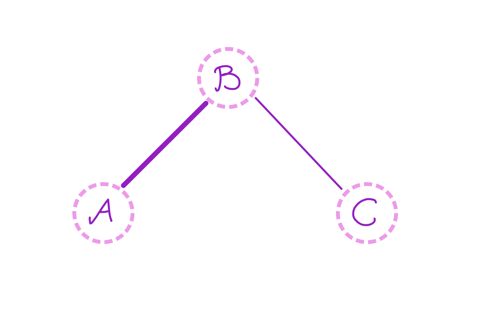 

different weights of connection, represented by a thicker edge]

???
A stronger connection of two nodes can be represented by a thicker edge, for example if people are family members or even married instead of just being friends. That is the so-called "edge weight".

---
# 2.4 edge weights

.center[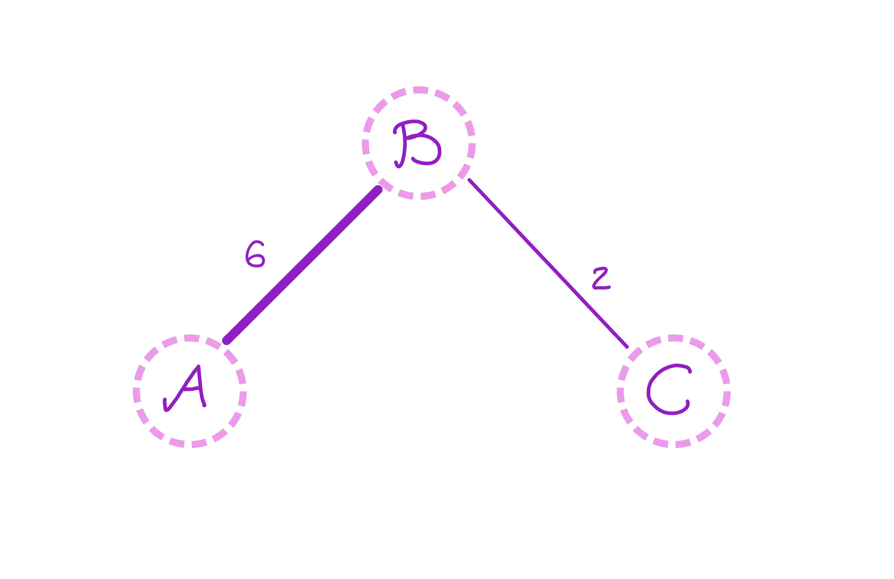

different weights of connection, additionally represented by a number]

???
It can be also indicated by a number that represents the weight – this is also the kind of information we would typically find in a network data set.

---
background-image: url("media/more_terms1.jpg")
background-position: center
background-size: 120%

# What great things we are missing...

<br /> <br /> <br /> <br /> <br /> <br /> <br /> <br /> <br /> <br /> <br /> <br /> <br />
Learn more about: density, <br />
degree distribution, clustering, <br />
centrality, connectivity, cohesion, <br />
random graphs, small worlds...

...in lectures by Jen Golbeck: 

network [basics](https://www.youtube.com/watch?v=CY1HVqKQObU) <br />
network [structure](https://www.youtube.com/watch?v=89mxOdwPfxA)

???
Of course there are many more concepts - I mean, at the end, network analysis is a whole discipline of its own. 

If you are interested in gaining a deeper conceptual knowledge, we can highly recommend Jen Golbeck's lectures on network basics and network structure at the university of Maryland, on which my explanations were based as well.

Thanks for listening and now I hand over to Ania for the introduction of the packages.
---
class: inverse

# Tidygraph

Tidygraph is not a tool to data visualisation but allows to structure the network databases. It provides the functions that allow to present data in the form of two combined tables of nodes and edges.

You can find the basic information on the package itself [here](https://tidygraph.data-imaginist.com/) and the description of the main functions [here](https://cran.r-project.org/web/packages/tidygraph/tidygraph.pdf).

.center[]

---
## 3. Tidygraph functions
```{r}
library(tidygraph)
library(tidyverse)

head(routes)
```
.footnote[Source: [https://rviews.rstudio.com/2019/03/06/intro-to-graph-analysis/](https://rviews.rstudio.com/2019/03/06/intro-to-graph-analysis/)]

---
### 3.1 `tidygraph::tbl_graph()` and `as.tbl_graph()`

There are two main ways to prepare data for network analysis in the tidy format:
- by using **`tbl_graph()`**. It combines two tables, with nodes and with edges, into one
- use the function **`as.tbl_graph()`** to transform an existing data set into a tidygraph format

```{r eval= FALSE}
graph_routes <- as_tbl_graph(routes)
graph_routes
```

---
```{r}
graph_routes <- as_tbl_graph(routes)
graph_routes
```

---
### 3.2 `tidygraph::activate()`

By default, after using **`tbl_graph()`** or **`as.tbl_graph`** nodes are active. By using **`activate()`**, we can specify whether we would like to work on the edges or nodes.
```{r, eval=FALSE}
graph_routes <- graph_routes %>%
  activate(nodes) %>%
  mutate(
    title = str_to_title(name),
    label = str_replace_all(title, " ", "\n")
    )
graph_routes
```
---
```{r}
graph_routes <- graph_routes %>%
  activate(nodes) %>%
  mutate(
    title = str_to_title(name),
    label = str_replace_all(title, " ", "\n")
    )
graph_routes
```

---
With the tidyverse function **`as_tibble()`** we can extract the activated data - either nodes or edges - in the form of a table.


```{r}
graph_routes %>% as_tibble()
```

---
### 3.3 `tidygraph::centrality_degree()` and `centrality_betweenness()`

To measure the importance of the node in a particular network one can use centrality functions.
 
- Function **`centrality_betweenness()`** will give the measure of centrality based on how many times a node is on the shortest path to another node. 
- Function **`centrality_degree()`** will provide us with the measure based on how many links a node has with other. 
- By default for nodes, some have also an **`_edge_`** equivalent.

---

```{r}
play_erdos_renyi(10, 0.5)
```
.footnote[Source: https://tidygraph.data-imaginist.com/]

---

```{r}
play_erdos_renyi(10, 0.5) %>% 
  activate(nodes) %>% 
  mutate(degree = centrality_degree()) %>% 
  activate(edges) %>% 
  mutate(centrality = centrality_edge_betweenness()) %>% 
  arrange(centrality)
```

---
### 3.4 `tidygraph::morph` and `unmorph`

- **`morph()`** and **`unmorph()`** are particularly useful to manipulate specific elements, eg. as selected nodes or edges. 
- While using **`morph()`** you create an alternative to an existing graph and it's data. When you are done, **`unmorph()`** allows you to automatically apply the changes to the original graph. 

.center[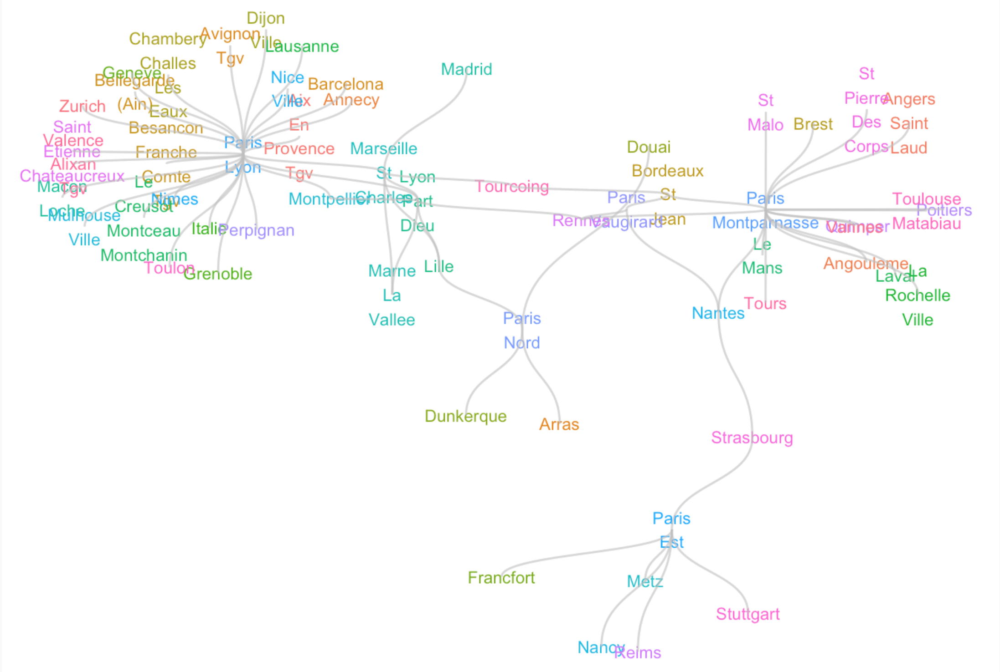]

---
```{r eval=FALSE}
from <- which(stations == "Arras")
to <-  which(stations == "Nancy")
shortest <- graph_routes %>%
morph(to_shortest_path, from, to, weights = journey_time)
shortest
```

.center[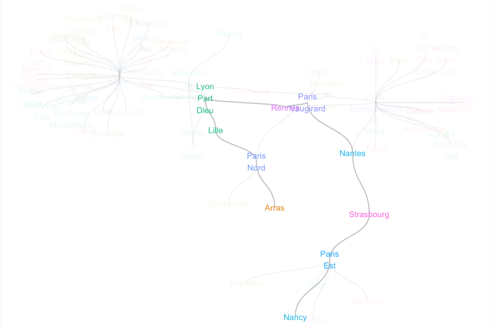]

---
### 3.5 `tidygraph::bind_nodes()` and `bind_edges()`

One can add, both nodes and edges, to a `tbl_graph` by using **`bind_nodes()`** and **`bind_edges()`**. It is also possible to use the `dyplr::bind_rows()` function. 
```{r eval=FALSE}
bind_nodes(.data, ...)
bind_edges(.data, ..., node_key = "name")
```

If you are interested in structure of the networks and how to manipulate them, we recommend [this resource](https://michaelgastner.com/DAVisR2021/essentials-of-network-analysis.html#sec:centrality).

---
class: inverse

# ggraph

`ggraph` is a `ggplot2` extension designed to work with relational structures such as networks. There are several functions that allow users to create network graphs in an interesting way. For the description of the main functions please refer to [the cran website](https://cran.r-project.org/web/packages/ggraph/ggraph.pdf). You can also acquire the most important information about the package [here](https://ggraph.data-imaginist.com/).

.center[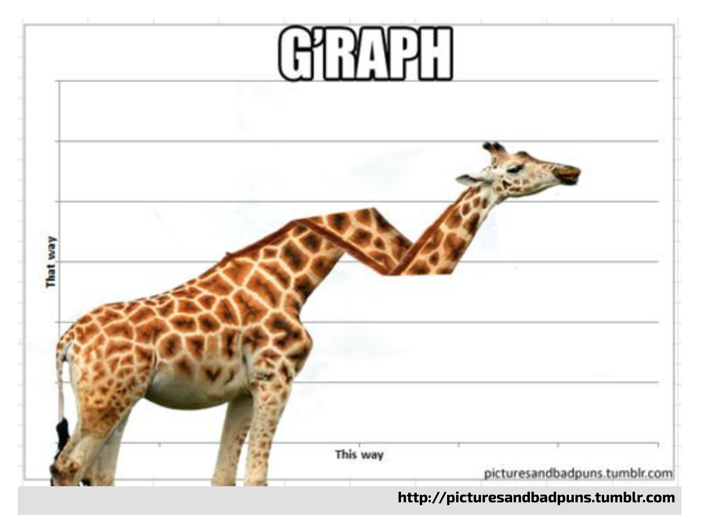]

---
# 4. ggraph

```{r include=FALSE}
library(pkgnet)
```

```{r message=FALSE, warning=FALSE}
library(ggraph)
library(igraph)
library(ggplot2)
```

```{r}
graph <- as_tbl_graph(highschool)
head(highschool)
```
Credits to the [data imaginist](https://www.data-imaginist.com/) for the following examples.

---
### 4.1 `ggraph::autograph()`
To get the idea of the structure of the network one can use **`autograph()`**
```{r, fig.height=6, fig.width=9}
autograph(graph)
```

---
### 4.2 `geom_node_*()`

With **`geom_node_*()`** functions you can adapt visualisation of nodes depending on your needs. 

- **`geom_node_circle()`** nodes as circles
- **`geom_node_point()`**  nodes as points 
- **`geom_node_text()`**	 nodes with text

```{r, fig.height=3.5, fig.width=6}
ggraph(graph, layout = 'fr', weights = centrality_edge_betweenness()) + 
  geom_edge_link() + 
  geom_node_point(aes(size = centrality_pagerank(), colour = node_is_center()))
```

---
### 4.3 `geom_edge_*()`

Similar can be obtained for edges. 

- **geom_edge_arc()**	  edges as arcs
- **geom_edge_bend()**	edges as diagonals
- **geom_edge_link()**	edges as straight lines between nodes

```{r, fig.height=4, fig.width=8}
ggraph(graph, layout = 'linear') + 
    geom_edge_arc(aes(colour = factor(year)))
```

---
### 4.4 `layout_tbl_graph_*()`
Usually you can simply define the type of layout within the `ggraph function`, e.g. **`ggraph(graph, layout = '...')`**, but you can also apply several layouts with `layout_tbl_graph_*()` functions.

- **layout_tbl_graph_auto()** =  layout based on graph type
- **layout_tbl_graph_centrality()** = nodes in circles based on centrality measure
- **layout_tbl_graph_manual()** = manualy set

---
### 4.5 Example ([Source](http://mr.schochastics.net/netVizR.html))

```{r eval=FALSE}
ggraph(gotS1,layout = "stress")+
  geom_edge_link0(aes(edge_width = weight),edge_colour = "grey66")+
  geom_node_point(aes(fill = clu,size = size),shape = 21)+
  geom_node_text(aes(filter = size >= 26, label = name),family="serif")+
  scale_fill_manual(values = got_palette)+
  scale_edge_width(range = c(0.2,3))+
  scale_size(range = c(1,6))+
  theme_graph()+
  theme(legend.position = "none")
```

.center[]
 
---
# Thank you for listening - let's get started!
.center[]

